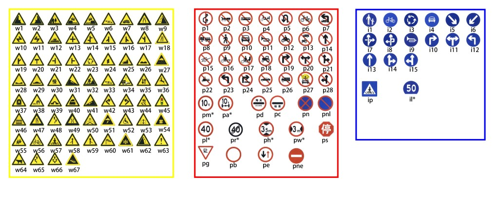
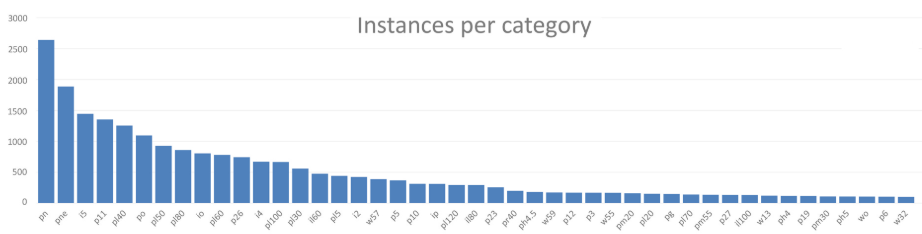
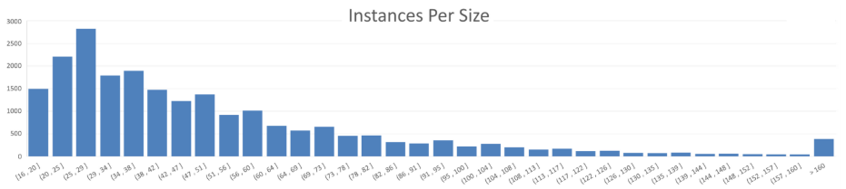
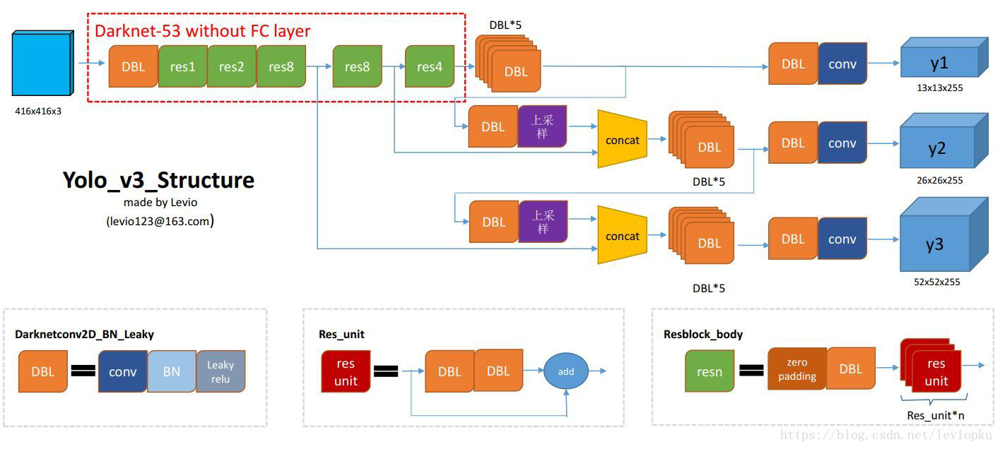
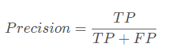
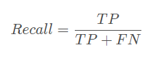

## 交通标志检测

### 1.数据集
* tt100k交通标志数据集 https://cg.cs.tsinghua.edu.cn/traffic-sign/
* 分辨率2048x2048
* 100000张图片，其中10000张图片包含30000个交通标志

* 存在交通标志类别不均衡问题，具体如下图，表示每个类别的数量

* 小目标最常见，如下图，表示不同大小的目标数量

### 2.数据增强
* 随机裁剪和缩放
* 随机旋转
* 随机对比度和亮度
* 随机饱和度
* 随机变换色度(HSV空间下(-180, 180))

### 3.针对交通标志检测改进yolov3
* yolov3结构

* 用k均值聚类重新选择anchor box，原来是9个（10,13,  16,30,  33,23,  30,61,  62,45,  59,119,  116,90,  156,198,  373,326），
参考项目https://github.com/lars76/kmeans-anchor-boxes
* 采用深度可分离卷积，减小计算量，提高检测速度
* GIoU

### 4.结论和对比
* precision（精确度）和recall（召回率）
  *  TP（True Positives）意思就是被分为了正样本，而且分对了。
  * TN（True Negatives）意思就是被分为了负样本，而且分对了，
  * FP（False Positives）意思就是被分为了正样本，但是分错了（事实上这个样本是负样本）。
  * FN（False Negatives）意思就是被分为了负样本，但是分错了（事实上这个样本是这样本）。

* 计算mAP，参考 https://github.com/Cartucho/mAP

当我们取不同的置信度，可以获得不同的Precision和不同的Recall，当我们取得置信度够密集的时候，就可以获得非常多的Precision和Recall。
此时Precision和Recall可以在图片上画出一条线，这条线下部分的面积就是某个类的AP值。
mAP就是所有的类的AP值求平均。

### 参考：
* YOLOv3: An Incremental Improvement
* Traffic-Sign Detection and Classification in the Wild
* 改进YOLOv3的交通标志检测方法研究_邓天民
* 基于YOLO+v3的交通标志牌检测识别_潘卫国
* 基于深度可分离卷积的交通标志识别算法_杨晋生
* 交通标志识别方法综述_伍晓晖
* 基于YOLOv3的深度学习交通标志识别系统_张钟文
* Generalized Intersection over Union: A Metric and A Loss for Bounding Box Regression

### 代码结构

- yolo3-pytorch
  - nets 
    - darknet.py darknet主干网络
    - yolo3.py
    - yolo_training.py
  - utils
    - config.py
    - dataloader.py
    - utils.py
  - tt100k_annotation.py 读取标签文件,生成tt100k_train.txt，包含图片地址、每个目标的真实框(xmin, ymin, xmax, ymax)以及类别
  