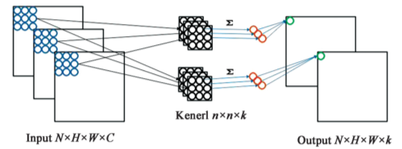
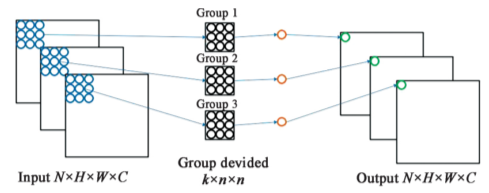
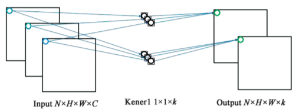

## 交通标志检测

### 1.数据集
* tt100k交通标志数据集 https://cg.cs.tsinghua.edu.cn/traffic-sign/
* 分辨率2048x2048
* 100000张图片，其中10000张图片包含30000个交通标志

* 存在交通标志类别不均衡问题，具体如下图，表示每个类别的数量

* 小目标最常见，如下图，表示不同大小的目标数量


### 2.数据增强
* 随机裁剪和缩放
* 随机旋转
* 随机对比度和亮度
* 随机饱和度
* 随机变换色度(HSV空间下(-180, 180))

### 3.针对交通标志检测改进yolov3
* yolov3结构

  * Darknet-53 由 5 个残差块组成，每个残差块由残差单元组成，残差单元中由 DBL 单元组成，两 个 DBL 单元在残差块中进行残差操作。其中DBL 单元包含了卷积层（convolutional）、 批归一化（Batch Normalization）和 leaky Relu 激活函数，通过引入残差结构，可以增加网络架构的深度并防止训练的过程梯度爆炸和消失等问题。
  * Darknet的输出再经过一定的卷积和特征融合，最终生成3个输出。分别为13x13、26x26、52x52，对应32倍、16倍和8倍下采样。下采样倍数高的特征图感受野较大，适合检测较大的目标。下采样倍数小的则适合检测小目标。
  * 以13x13的特征图为例，输出尺寸为3x13x13x(1+4+m),其中3对应每个网格anchor box的个数，1表示是否存在目标，m对应目标的类别个数。
* 用k均值聚类重新选择anchor box，原来是9个（10,13,  16,30,  33,23,  30,61,  62,45,  59,119,  116,90,  156,198,  373,326），
参考项目https://github.com/lars76/kmeans-anchor-boxes
* 采用深度可分离卷积，减小计算量，提高检测速度
  * 对于传统的卷积运算，有Ｎ×Ｈ×Ｗ×Ｃ的 输入与ｋ个ｎ×ｎ的卷积核进行卷积运算，在 ｐａｄ＝１和ｓｔｒｉｄｅ＝１的情况下输出为Ｎ×Ｈ×
Ｗ×ｋ

  * 对于深度可分离卷积，在Ｄｅｐｔｈｗｉｓｅ过程中， 将输入的Ｎ×Ｈ×Ｗ×Ｃ划分成Ｃ组，对于每一 组做ｎ×ｎ的卷积运算，收集卷积运算中的每个
ｃｈａｎｎｅｌ的空间特征

  * 在Ｐｏｉｎｔｗｉｓｅ过程中，对 Ｄｅｐｔｈｗｉｓｅ中的结 果进行ｋ个１×１的卷积运算，收集每个ｐｏｉｎｔ上 的特征，也就是卷积运算中的位置特征，经过 Ｐｏｉｎｔｗｉｓｅ和Ｄｅｐｔｈｗｉｓｅ两个步骤，最终输出的结
果也是Ｎ×Ｈ×Ｗ×ｋ

```python
import torch.nn as nn
class depthwise_separable_conv(nn.Module):
    def init(self, nin, nout):
        super(depthwise_separable_conv, self).init()
        self.depthwise = nn.Conv2d(nin, nin, kernel_size=3, padding=1, groups=nin)
        self.pointwise = nn.Conv2d(nin, nout, kernel_size=1)
    def forward(self, x):
        out = self.depthwise(x)
        out = self.pointwise(out)
        return out
```
* GIoU

### 4.结论和对比
* precision（精确度）和recall（召回率）
  *  TP（True Positives）意思就是被分为了正样本，而且分对了。
  * TN（True Negatives）意思就是被分为了负样本，而且分对了，
  * FP（False Positives）意思就是被分为了正样本，但是分错了（事实上这个样本是负样本）。
  * FN（False Negatives）意思就是被分为了负样本，但是分错了（事实上这个样本是这样本）。


* 计算mAP，参考 https://github.com/Cartucho/mAP

当我们取不同的置信度，可以获得不同的Precision和不同的Recall，当我们取得置信度够密集的时候，就可以获得非常多的Precision和Recall。
此时Precision和Recall可以在图片上画出一条线，这条线下部分的面积就是某个类的AP值。
mAP就是所有的类的AP值求平均。

### 参考：
* YOLOv3: An Incremental Improvement
* Traffic-Sign Detection and Classification in the Wild
* 改进YOLOv3的交通标志检测方法研究_邓天民
* 基于YOLO+v3的交通标志牌检测识别_潘卫国
* 基于深度可分离卷积的交通标志识别算法_杨晋生
* 交通标志识别方法综述_伍晓晖
* 基于YOLOv3的深度学习交通标志识别系统_张钟文
* Generalized Intersection over Union: A Metric and A Loss for Bounding Box Regression

### 代码结构

- yolo3-pytorch
  - nets 
    - darknet.py darknet主干网络
    - yolo3.py
    - yolo_training.py
  - utils
    - config.py
    - dataloader.py
    - utils.py
  - tt100k_annotation.py 读取标签文件,生成tt100k_train.txt，包含图片地址、每个目标的真实框(xmin, ymin, xmax, ymax)以及类别
  - train.py
  - predict.py
  - test.py
  - yolo.py